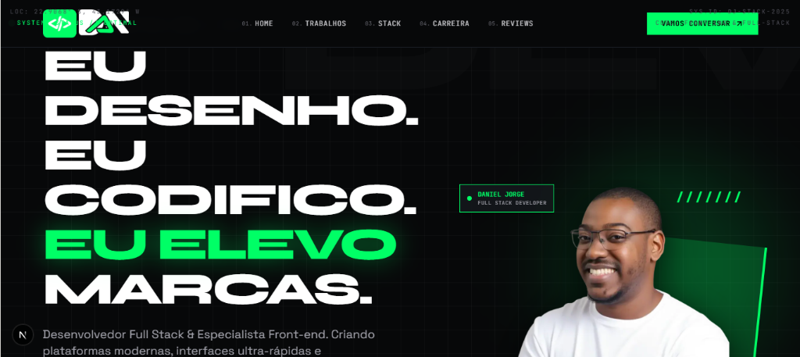

<div align="center">

# ⚡ DANIEL JORGE // PORTFOLIO V3.0
### Desenvolvedor Front-end & Full Stack — Next.js 16 • React 19 • TypeScript • Tailwind CSS

[](https://nextjs.org/)
[](https://react.dev/)
[](https://www.typescriptlang.org/)
[](https://tailwindcss.com/)
[](https://turbo.build/)
[](https://www.danieljorge.dev.br)
[](https://www.danieljorge.dev.br)

<br />

<!-- CAPA DO PROJETO -->
<a href="https://www.danieljorge.dev.br" target="_blank">
  
</a>

<br />

**[🌐 Acessar Portfólio Online](https://www.danieljorge.dev.br)** • **[💬 Iniciar Conversa no WhatsApp](https://wa.me/5521972826868)** • **[💼 LinkedIn](https://www.linkedin.com/in/danieljorgee/)**

</div>

---

## 🎯 Sobre o Projeto

O **Portfólio v3.0** de **Daniel Jorge** foi construído do zero com arquitetura moderna orientada a performance e estética **Cyberpunk Brutalista**. Inspirado em interfaces táticas digitais (HUDs), traz uma paleta escura profunda com acentos **Neon Green (`#00FF66`)**, tipografia de alto impacto e micro-interações dinâmicas.

O projeto foi projetado pensando em manutenibilidade e escalabilidade, centralizando todos os dados e conteúdos em um único arquivo mestre de fácil edição, eliminando dependências pesadas de bibliotecas de ícones e utilizando o motor de bundling **Turbopack** do **Next.js 16**.

---

## ⚡ Destaques & Diferenciais

- **🚀 Next.js 16 (App Router) + Turbopack**: Compilação ultrarrápida e renderização híbrida otimizada para Core Web Vitals.
- **🌓 Tema Claro & Escuro (Light / Dark Mode)**: Alternador de tema intuitivo com persistência em `localStorage`, script anti-FOUC (sem cintilação) e logotipos adaptativos de alto contraste (`logo-white-green.png` e `logo-black-green.png`).
- **🌐 Multi-Linguagem Completo (PT / EN)**: Suporte nativo a Português (padrão) e Inglês em 100% das seções, projetos, métricas, formulários e integração do WhatsApp, com seletor `[ PT | EN ]` interativo no cabeçalho e persistência de preferência.
- **🎨 Design System Cyberpunk Brutalista**: Grid holográfico, glow effects, badge status HUD e fontes personalizadas (*Space Grotesk*, *Syne* e *JetBrains Mono*).
- **📱 Responsividade Estratégica (Mobile First)**: No desktop, layout equilibrado em grid; no mobile, a fotografia do desenvolvedor ganha prioridade superior no Hero com o texto posicionado logo abaixo.
- **🧩 Ícones SVG Nativos Inline**: Zero overhead de bibliotecas pesadas de terceiros (sem lucide-react), reduzindo drasticamente o First Contentful Paint.
- **🎬 Micro-animações e Scroll Reveal**: Efeitos de fade-in táticos e transições suaves ativadas conforme o usuário rola a página.
- **📂 Arquitetura 100% Desacoplada**: Todas as informações do site (projetos, links, textos, stack e contatos) são configuradas em `src/data/portfolio.ts`.
- **💬 Formulário Direto para WhatsApp**: Disparo automático de mensagem estruturada e higienizada diretamente no WhatsApp do desenvolvedor no idioma selecionado.

---

## 🛠️ Tecnologias & Ferramentas

| Categoria | Tecnologia | Finalidade |
| :--- | :--- | :--- |
| **Framework** | Next.js 16.3.5 | App Router, Server Components e Otimização de Imagens |
| **Biblioteca UI** | React 19 | Criação e ciclo de vida de componentes reativos |
| **Linguagem** | TypeScript 5 | Tipagem estrita e segurança em tempo de desenvolvimento |
| **Estilização** | Tailwind CSS v3 | Design system utilitário com extensões cyberpunk |
| **Ícones** | SVG Inline Customizado | SVGs otimizados sob medida em `CyberIcons.tsx` |
| **Fontes** | Google Fonts | `next/font/google` com Syne, Space Grotesk e JetBrains Mono |
| **Bundler** | Turbopack | Fast Refresh e builds ultra-otimizados |

---

## 📂 Estrutura do Projeto

```text
portfolio-III/
├── public/
│   ├── images/
│   │   ├── cover.png                  # Imagem de capa oficial do projeto
│   │   ├── logo-white-green.png       # Logotipo adaptativo para tema escuro
│   │   ├── logo-black-green.png       # Logotipo adaptativo para tema claro
│   │   ├── logo-symbol.png            # Ícone/símbolo oficial do desenvolvedor
│   │   ├── sobreMim-01.webp           # Foto oficial de Daniel Jorge (Hero)
│   │   └── projects/                  # Mockups e screenshots dos projetos
│   ├── favicon.png                    # Ícone de favoritos oficial
│   └── curriculo.pdf                  # Currículo em PDF para download
├── src/
│   ├── app/
│   │   ├── globals.css                # Estilos globais, grid cyberpunk e utilitários
│   │   ├── layout.tsx                 # Providers, Metadados SEO, OpenGraph e Fontes
│   │   └── page.tsx                   # Composição principal das seções da landing page
│   ├── components/
│   │   ├── HudOverlay.tsx             # Indicadores HUD (status do sistema e coordenadas)
│   │   ├── Navbar.tsx                 # Barra com alternador de tema e seletor [ PT | EN ]
│   │   ├── Hero.tsx                   # Seção de abertura com kinetic typography e foto
│   │   ├── MarqueeTicker.tsx          # Ticker neon infinito com especialidades
│   │   ├── FeaturedProjects.tsx       # Vitrine de projetos com tags e links
│   │   ├── CaseStudy.tsx              # Estudo de caso com métricas e dashboard interativo
│   │   ├── TechStack.tsx              # Grid tático do arsenal de tecnologias
│   │   ├── ExperienceTimeline.tsx     # Linha do tempo profissional (2019 - Presente)
│   │   ├── Testimonials.tsx           # Prova social e depoimentos de clientes
│   │   ├── ContactSection.tsx         # Formulário com integração WhatsApp e redes
│   │   ├── Footer.tsx                 # Rodapé cyberpunk com copyright e links rápidos
│   │   ├── icons/
│   │   │   └── CyberIcons.tsx         # Componente central de ícones SVG inline
│   │   └── motion/
│   │       └── ScrollRevealObserver.tsx # Observer nativo para efeitos de entrada ao scroll
│   ├── context/
│   │   ├── ThemeContext.tsx           # Gerenciador de tema claro/escuro com localStorage
│   │   └── LanguageContext.tsx        # Gerenciador de idioma (PT/EN) com localStorage
│   └── data/
│       └── portfolio.ts               # Arquivo mestre bilíngue (PT & EN) e traduções de UI
├── cover.png                          # Capa do projeto para visualização direta no repositório
├── tailwind.config.ts                 # Paleta neon, sombras, keyframes e temas
├── tsconfig.json                      # Configurações do compilador TypeScript
└── package.json                       # Scripts e dependências do projeto
```

---

## 🚀 Como Executar Localmente

### Pré-requisitos
- **Node.js** (versão 18.18+ ou 20+)
- **npm** (ou yarn / pnpm)

### Passo a Passo

1. **Clone o repositório:**
   ```bash
   git clone https://github.com/danyeljorge/portfolio-v3.git
   cd portfolio-v3
   ```

2. **Instale as dependências:**
   ```bash
   npm install
   ```

3. **Inicie o servidor de desenvolvimento:**
   ```bash
   npm run dev
   ```
   Abra seu navegador em [http://localhost:3000](http://localhost:3000).

4. **Gerar build de produção:**
   ```bash
   npm run build
   ```

5. **Executar o build gerado:**
   ```bash
   npm run start
   ```

---

## 🛠️ Como Atualizar o Conteúdo & Multi-Linguagem

Toda a gestão de conteúdo do site é centralizada em:

📁 **[`src/data/portfolio.ts`](./src/data/portfolio.ts)**

O arquivo é organizado em estruturas tipadas e bilíngues:
- **`PORTFOLIO_DATA_PT`**: Todo o conteúdo em Português (projetos, biografia, timeline, depoimentos e contatos).
- **`PORTFOLIO_DATA_EN`**: Todo o conteúdo traduzido para Inglês com tom profissional e editorial.
- **`UI_TRANSLATIONS`**: Textos de interface, botões, placeholders de formulário e mensagens de feedback para ambos os idiomas (`pt` e `en`).
- **`PORTFOLIO_DATA` / `getPortfolioData(lang)`**: Métodos auxiliares para consumo reativo e retrocompatível.

### Campos editáveis:
- **Projetos (`featuredProjects`)**: Adicione novos cards, links do repositório/site, métricas de resultado e screenshots.
- **Estudo de Caso (`caseStudy`)**: Métricas de conversão, links do dashboard e logs de terminal.
- **Textos do Hero (`heroHeadline` / `shortBio`)**: Títulos de impacto e resumo profissional.
- **Redes Sociais (`socialLinks`)**: Links para LinkedIn, GitHub, Instagram e YouTube.
- **Contato & WhatsApp (`contact`)**: Telefone, e-mail e texto pré-formatado para geração do link de WhatsApp.
- **Arsenal Técnico (`techStack`)**: Atualize as tecnologias, funções e categorias exibidas.
- **Trajetória (`experience`)**: Adicione novas conquistas e marcos na linha do tempo.
- **Depoimentos (`testimonials`)**: Insira novos feedbacks de clientes e parceiros.

---

## 👨‍💻 Autor & Contato

**Daniel Jorge**  
*Desenvolvedor Web Front-end & Full Stack*

- 🌐 **Site:** [danieljorge.dev.br](https://www.danieljorge.dev.br)
- 💼 **LinkedIn:** [/in/danieljorgee](https://www.linkedin.com/in/danieljorgee/)
- 🐙 **GitHub:** [@danyeljorge](https://github.com/danyeljorge)
- 📸 **Instagram:** [@danyeljorgee](https://www.instagram.com/danyeljorgee/)
- 🎥 **YouTube:** [@trilhadacomputacao](https://www.youtube.com/@trilhadacomputacao)
- 💬 **WhatsApp:** [+55 (21) 97282-6868](https://wa.me/5521972826868)

---

<div align="center">
  <sub>Desenvolvido com ⚡ por Daniel Jorge • Rio de Janeiro, Brasil</sub>
</div>